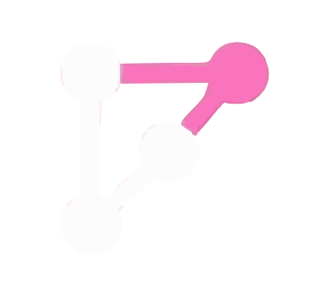
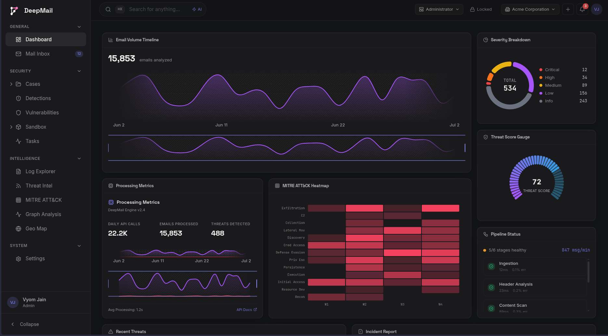
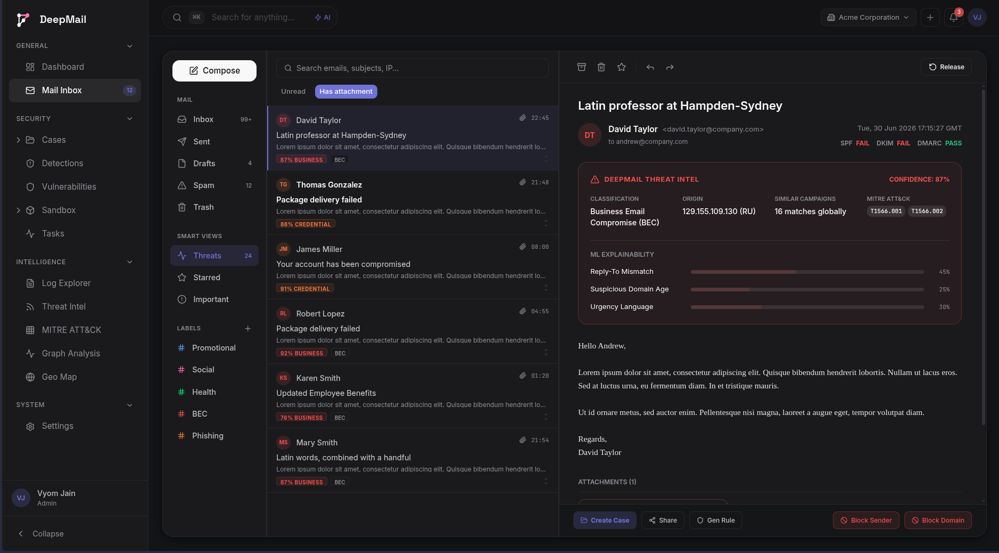
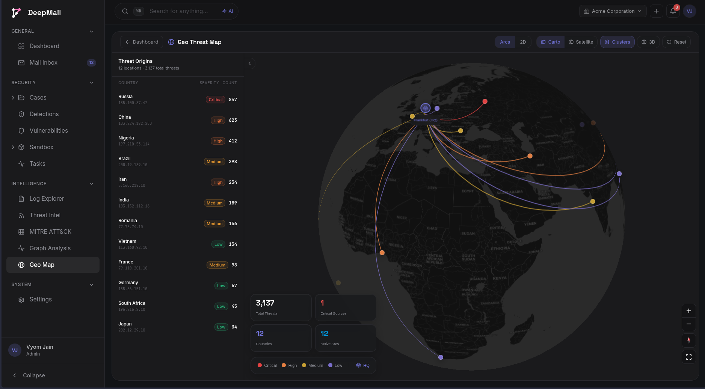
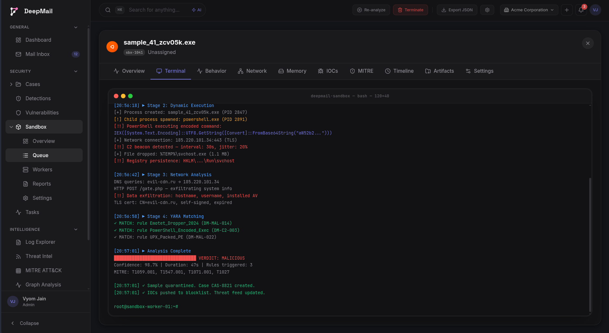
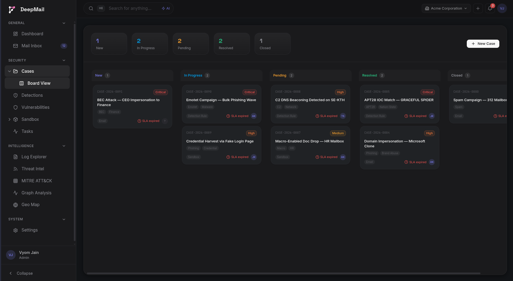
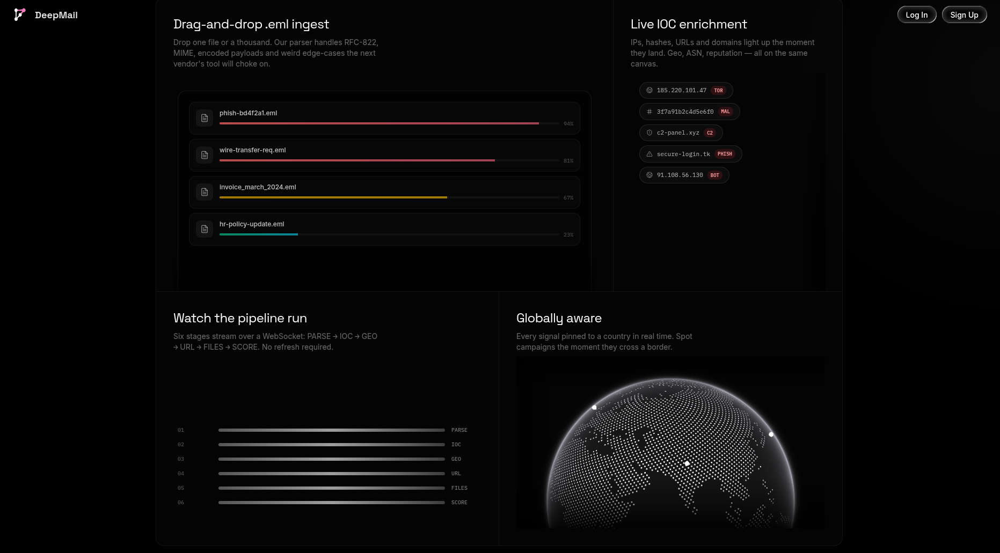

<p align="center">
  
</p>

<h1 align="center">DeepMail Dashboard</h1>

<p align="center">
  Open-source email threat intelligence platform with a customizable SOC dashboard
</p>

<p align="center">
  <a href="https://github.com/DeepMail-org/deepmail-dashboard/blob/main/LICENSE">
    
  </a>
  <a href="https://github.com/DeepMail-org/deepmail-dashboard/stargazers">
    
  </a>
  <a href="https://github.com/DeepMail-org/deepmail-dashboard/network/members">
    
  </a>
  <a href="https://github.com/DeepMail-org/deepmail-dashboard/issues">
    
  </a>
  <a href="https://github.com/DeepMail-org/deepmail-dashboard/commits/main">
    
  </a>
</p>

<p align="center">
  
  
  
  
</p>

---

DeepMail unifies threat detection, sandboxing, MITRE ATT&CK mapping, and incident response into a single browser-based dashboard -- eliminating the need for fragmented security tools.

## Screenshots

<table>
  <tr>
    <td align="center"><strong>Main Dashboard</strong></td>
    <td align="center"><strong>Email Inbox</strong></td>
    <td align="center"><strong>Geo Threat Map</strong></td>
  </tr>
  <tr>
    <td></td>
    <td></td>
    <td></td>
  </tr>
  <tr>
    <td align="center"><strong>Sandbox Queue</strong></td>
    <td align="center"><strong>Cases Kanban</strong></td>
    <td align="center"><strong>Landing Page</strong></td>
  </tr>
  <tr>
    <td></td>
    <td></td>
    <td></td>
  </tr>
</table>

## Features

### Threat Detection and Analysis

- Real-time threat monitoring with live WebSocket updates
- Severity breakdown with donut charts
- Threat volume timeline with grouped bar charts
- Top alert categories and malicious senders tracking

### Intelligence and Investigation

- Geo threat map with MapLibre GL clustering and arc visualization
- MITRE ATT&CK heatmap mapping detections to techniques
- Active IOCs (Indicators of Compromise) tracking
- n8n-style workflow graphs for investigation pipelines

### Email Client

- 3-panel resizable email client (sidebar, mail list, mail detail)
- Real-time WebSocket updates for new emails
- Keyboard shortcuts for power users
- Compose modal with rich text editing

### Sandbox Analysis

- XState-driven task lifecycle (PENDING, RUNNING, COMPLETED, FAILED)
- File analysis with progress bars and verdict indicators
- Worker node infrastructure monitoring
- Integration with VirusTotal, GreyNoise

### Dashboard Customization

- 22+ widgets across 5 categories (Core, Intelligence, Operational, Sandbox, Platform)
- Drag-and-drop grid layout with react-grid-layout
- Role-based templates (Administrator, Analyst)
- Persistent layouts via localStorage
- Widget marketplace for extensibility

### Security and Authentication

- JWT-based authentication with OTP verification
- Role-based access control
- API key management
- Security settings (2FA, session management)

## Quick Start

### Prerequisites

- [Bun](https://bun.sh/) (package manager)
- Backend services running (see [root README](../README.md#quick-start))

### Installation

```bash
# Clone the repository
git clone https://github.com/DeepMail-org/deepmail-dashboard.git
cd deepmail-dashboard

# Install dependencies
bun install

# Configure environment
cp .env.example .env.local
# Edit .env.local with your backend URLs

# Start development server
bun dev
```

Open [http://localhost:3000](http://localhost:3000)

## Tech Stack

| Category         | Technology                           |
| ---------------- | ------------------------------------ |
| Framework        | Next.js 16, React 19, TypeScript 5.9 |
| Styling          | Tailwind CSS v4                      |
| State Management | Zustand 5 (persisted stores)         |
| Server State     | TanStack React Query 5               |
| Charts           | ECharts 6, Recharts 3                |
| Grid Layout      | react-grid-layout                    |
| Maps             | MapLibre GL                          |
| 3D / Globe       | Three.js, cobe                       |
| Animation        | Framer Motion, GSAP                  |
| UI Primitives    | Radix UI, shadcn/ui                  |
| Package Manager  | Bun                                  |

## Project Structure

```
src/
├── app/                    # Next.js App Router routes
│   ├── (marketing)/        # Public pages (landing, auth, payments)
│   └── (dashboard)/        # Authenticated app pages
├── components/
│   ├── layout/             # App shell, sidebar, topbar
│   ├── dashboard/          # Widget grid, marketplace, command palette
│   ├── widgets/            # 22+ widget components
│   └── ui/                 # Reusable UI primitives (shadcn/ui)
├── stores/                 # Zustand stores (auth, dashboard, mail, etc.)
├── hooks/                  # Custom React hooks
├── lib/                    # Utilities, API client, WebSocket manager
└── public/                 # Static assets (logos, favicons)
```

## Deployment

### Vercel (Recommended)

1. Push to GitHub
2. Import on [vercel.com/new](https://vercel.com/new)
3. Set environment variables
4. Deploy

### Docker

```bash
docker build -t deepmail-dashboard .
docker run -p 3000:3000 deepmail-dashboard
```

### Environment Variables

| Variable              | Required | Description                                                    |
| --------------------- | -------- | -------------------------------------------------------------- |
| `NEXT_PUBLIC_API_URL` | Yes      | Backend REST API URL (default: `http://localhost:8000/api/v1`) |
| `NEXT_PUBLIC_WS_URL`  | Yes      | Backend WebSocket URL (default: `ws://localhost:8000/ws`)      |

## Contributing

Contributions are welcome. Please follow these steps:

1. Fork the repository
2. Create a feature branch (`git checkout -b feature/amazing-feature`)
3. Commit changes (`git commit -m 'Add amazing feature'`)
4. Push to branch (`git push origin feature/amazing-feature`)
5. Open a Pull Request

Follow the existing code style (ESLint + TypeScript strict mode).

## License

MIT License - see [LICENSE](LICENSE) for details.

---

## Community

### Contributors

<a href="https://github.com/DeepMail-org/deepmail-dashboard/graphs/contributors">
  
</a>

### Stargazers

<a href="https://github.com/DeepMail-org/deepmail-dashboard/stargazers">
  
</a>

### Connect

<p align="center">
  <a href="https://github.com/DeepMail-org">
    
  </a>
  <a href="https://x.com/Vyomjain6904">
    
  </a>
  <a href="https://www.linkedin.com/in/vyom-jain">
    
  </a>
</p>
